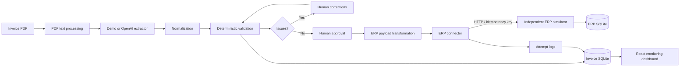

# Gulf Invoice Bridge

**AI-Powered Invoice Intelligence & Enterprise Integration Platform**

> AI extracts. Rules validate. Humans approve. APIs integrate.

## Overview

A working, local engineering portfolio product for invoice processing in a Saudi/UAE business context. React communicates with a FastAPI invoice API backed by SQLite. A separate ERP simulator receives approved invoices over HTTP and persists them in its own database.

**This is a portfolio prototype. It is not ZATCA certified, government-connected, an official Saudi or UAE e-invoicing solution, or production accounting/ERP software. All included companies and documents are fictional.**

## Business Problem

Supplier invoice data arrives in documents, while accounting systems need structured records. Manual re-entry introduces errors, delays, inconsistent data and poor visibility into integration failures.

## Solution

Extract text and structured fields, normalize values, validate deterministic rules, require human correction and approval, transform the approved record, then deliver through an ERP connector. Keep the original extraction evidence and every workflow/integration event available for inspection.

## Key Engineering Concepts

- Layered domain services, repositories, schemas and thin routes.
- AI provider abstraction; optional OpenAI structured extraction, with an offline demo parser.
- Decimal-safe financial rules and exact text-backed SQLite decimal storage.
- Explicit workflow transitions, optimistic concurrency and restart recovery.
- Independent HTTP dependency, stable idempotency keys and manual retries.
- Relational persistence, structured logging and database-derived monitoring.

## Architecture



See [architecture](docs/architecture.md), [API](docs/api.md), [portfolio summary](docs/portfolio.md) and [verification report](docs/verification.md).

## Features

- Safe PDF upload: generated storage keys, extension/MIME/signature validation, 10 MB / 30-page / 100,000-text-character limits.
- Actual text-based PDF extraction; three downloadable sample files in `sample-data/invoices/`.
- Review queue, editable invoice and line items, validation summary and approval controls.
- Search, status filter, supplier/date sorting and client-side pagination.
- Original extraction values, per-field confidence, processing time and audit timeline.
- ERP JSON viewer with clipboard copy; success, 401, 400, 500 and timeout simulations.
- Persistent request history, manual retries, duplicate delivery protection and service health checks.
- Responsive UI with keyboard controls, accessible form labels, textual status indicators and explicit error/empty/loading states.

## Technology Stack

| Layer | Technology |
| --- | --- |
| Frontend | React 19, TypeScript strict mode, Vite 6, Tailwind CSS 4, React Router |
| Backend | Python 3.12+, FastAPI, Pydantic, SQLAlchemy 2 |
| Database | SQLite, separate application and ERP databases |
| Documents / AI | pypdf, optional OpenAI Responses structured outputs |
| Tests / quality | Pytest, Vitest, React Testing Library, ESLint, Ruff, Prettier |
| Packaging | Docker Compose, nginx frontend proxy, pnpm lockfile |

## Project Structure

```text
backend/
  app/
    api/routes/           # Thin HTTP endpoints
    core/                 # Configuration, errors, structured logging
    db/                   # Engine/session creation
    models/               # Relational entities and exact decimal type
    schemas/              # External contracts and response serialization
    repositories/         # Database queries
    services/             # Workflow, extraction, normalization, rules, integration
    integrations/         # ERP abstraction and HTTP adapter
    erp/                  # Independent simulator application and persistence
    main.py               # API composition and lifecycle
  tests/                  # Isolated unit and API/integration tests
frontend/
  src/
    components/           # Reusable forms, tables, badges, payload and timeline
    pages/                # Overview, invoices, details, review, integrations, logs
    hooks/                # Async loading state
    services/             # Typed HTTP client
    types/                # Domain contracts
sample-data/invoices/     # Clean, review-required and financial-mismatch PDFs
scripts/                  # Dev startup, seed, HTTP acceptance check, PDF generator
docs/                    # Architecture, API, portfolio and verification
```

## Data Flow

Upload persists metadata and the source PDF. Extraction stores normalized relational fields/items and the original field evidence. Validation persists rule results. Any error or warning requires review; correcting and saving values invalidates previous validation. Only a newly validated invoice may be approved. Approved invoices are immutable. Integration rechecks rules, persists a pending attempt, then calls the connector. A stable source ID prevents repeated delivery from creating another ERP record. Failed attempts require an explicit retry.

## API

Interactive invoice API: [http://127.0.0.1:8000/docs](http://127.0.0.1:8000/docs).
Simulator API: [http://127.0.0.1:8001/docs](http://127.0.0.1:8001/docs).
Endpoint details and examples: [docs/api.md](docs/api.md).

## Demo Mode

Default configuration: `DEMO_MODE=true`, `AI_PROVIDER=demo`. No API credentials are needed. Demo extraction is a deterministic label parser, **not an AI inference call**. Its displayed confidence numbers are illustrative.

Three actual PDFs are supplied:

1. **Clean Invoice**: SAR invoice with consistent figures.
2. **Review Required Sample**: AED invoice missing a supplier tax number. Correct it to fictional value `100123456700003`.
3. **Financial Mismatch**: total 1200.00 versus expected 1150.00.

Create a populated dashboard after starting the services:

```bash
.venv/bin/python scripts/seed_demo.py
```

The idempotent script creates six `SEED-2026-*` invoices through actual upload/extraction/edit/validation/approval/integration endpoints. All are labeled DEMO. It preserves existing data. It uses the demo extractor; keep `AI_PROVIDER=demo` while seeding. Re-uploading a sample intentionally triggers duplicate detection; for repeated walkthroughs, edit its invoice number to a fresh fictional number before revalidation.

## Running Locally

Prerequisites: Python 3.12+, Node.js 22+ and pnpm 11. Run commands from the repository root. Install only the project dependencies:

```bash
python3 -m venv .venv
.venv/bin/python -m pip install -r backend/requirements-dev.txt
corepack enable
corepack prepare pnpm@11.19.0 --activate
pnpm --dir frontend install --frozen-lockfile
cp .env.example .env
./scripts/dev.sh
```

Open [http://127.0.0.1:5173](http://127.0.0.1:5173). The script starts all three processes and stops them together with Ctrl+C. Use a second terminal for seeding. Do not run multiple invoice API workers: startup recovery is designed for one local API process.

Alternatively use three terminals, from the root:

```bash
.venv/bin/uvicorn app.erp.main:app --app-dir backend --port 8001
.venv/bin/uvicorn app.main:app --app-dir backend --port 8000
pnpm --dir frontend dev
```

The dev script loads `.env`; direct commands require those variables exported in the shell. Default settings already work without an `.env` file. The Vite dev server proxies `/api` to port 8000. SQLite databases and uploaded files live in ignored `runtime/`.

### Environment Variables

| Variable | Default / purpose |
| --- | --- |
| `DATABASE_URL` | `sqlite:///./runtime/bridge.db` |
| `ERP_DATABASE_URL` | `sqlite:///./runtime/erp.db` |
| `UPLOAD_DIR` | `./runtime/uploads` |
| `DEMO_MODE` | `true`; enables sample creation and failure simulations |
| `AI_PROVIDER` | `demo` or `openai` |
| `OPENAI_API_KEY` | Empty; required only for OpenAI extraction |
| `OPENAI_MODEL` | `gpt-4.1-mini`; configurable structured-output-capable model |
| `ERP_BASE_URL` | `http://127.0.0.1:8001` |
| `ERP_TIMEOUT_SECONDS` | `5`; request timeout and simulation timing |

For optional AI extraction, set `AI_PROVIDER=openai`, provide your own key and restart. Extracted document text will be sent to OpenAI. The adapter uses `responses.parse` with a Pydantic schema and `store=False`; no live API call was made during verification. See [official Structured Outputs documentation](https://developers.openai.com/api/docs/guides/structured-outputs).

## Docker

```bash
docker compose up --build
```

Open the same frontend URL, port 5173. Compose starts frontend, backend and ERP, with named persistent volumes and health checks. Host ports are bound to loopback. To seed after startup, use the local Python seed script above against port 8000. `docker compose down` stops services and retains volumes. Docker configuration was prepared but **not launched in the development environment, where Docker was unavailable**.

## Testing

```bash
(cd backend && ../.venv/bin/python -m pytest -q)
.venv/bin/ruff check backend scripts
.venv/bin/ruff format --check backend scripts
pnpm --dir frontend test
pnpm --dir frontend lint
pnpm --dir frontend typecheck
pnpm --dir frontend build
```

Or run `./scripts/check.sh`. With both APIs running:

```bash
.venv/bin/python scripts/smoke_http.py
```

This acceptance script leaves a labeled demo invoice with five real HTTP attempts: 401, 400, 500, timeout and success. It asserts the entire review/approval/retry flow. Backend unit/API tests use isolated temporary databases. See [verification](docs/verification.md) for executed results and limits.

## 60-Second Demo

1. Open the dashboard; click **Process Invoice**.
2. Select **Review Required Sample**.
3. Click **Extract & validate**; point out the missing supplier tax number and original confidence evidence.
4. Click **Edit fields**; set supplier tax number to `100123456700003`.
5. **Save corrections** → **Re-run validation**; show **Validation Passed**.
6. Click **Approve invoice**.
7. Open **ERP payload & integration**, inspect the JSON and click **Copy JSON**.
8. Keep **Success · HTTP 200** selected; click **Integrate with ERP**.
9. Show the persisted `ERP-2026-xxxxx` reference; open **Activity logs** to show HTTP 200 / SUCCESS.

The first accepted invoice in an empty ERP database receives `ERP-2026-00001`. Seed and previous test deliveries advance the reference; the app never fabricates or resets it. The workflow is designed for a roughly one-minute presentation; exact timing varies by operator.

## Limitations

- Text PDFs only; no scanned-image OCR. Demo parsing supports the documented labeled sample format, not arbitrary invoice layouts.
- Single-user local prototype: no authentication, authorization, tenancy, malware scanning or production audit retention. Keep it local.
- Not a tax compliance engine. SAR/AED currency support does not imply legal VAT correctness, tax-number verification or e-invoicing certification.
- Lines represent net amounts, with line-level half-up rounding to cents and an inclusive 0.01 tolerance. Discounts, credit notes, mixed currencies, exchange rates and complex tax treatments are outside scope.
- Exact decimal inputs allow at most 18 digits / 4 decimal places; numbers with ambiguous decimal commas become missing and require correction.
- Confidence estimates are not calibrated probabilities. Saving a review acknowledges unresolved extraction uncertainty; deterministic errors and missing tax warnings still block approval.
- Extraction/integration are synchronous bounded requests. Startup recovery assumes one API process. No queue, multiworker scheduler, automatic retry or distributed transaction.
- Invoice listing/filtering is designed for a small local dataset; dashboard queries and frontend pagination are not optimized for enterprise volumes.
- OpenAI live extraction and Docker launch were not verified without credentials / Docker.

## Future Improvements

OCR adapter, versioned database migrations, authenticated roles, immutable field-level change history, stronger document sandboxing, pagination on the server, asynchronous job execution when required by scale, calibrated extraction evaluation, and a legitimate ERP adapter using the existing connector interface.

## GitHub Presentation

Suggested repository: **`gulf-invoice-bridge`**

Description: **AI-powered invoice processing and ERP integration platform demonstrating document extraction, business validation, human review, and API-based enterprise integration.**

Topics: `ai`, `data-engineering`, `api-integration`, `erp`, `fastapi`, `react`, `typescript`, `python`, `invoice-processing`, `enterprise-automation`.

## License

MIT. See [LICENSE](LICENSE).
