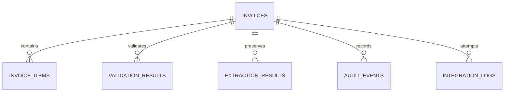
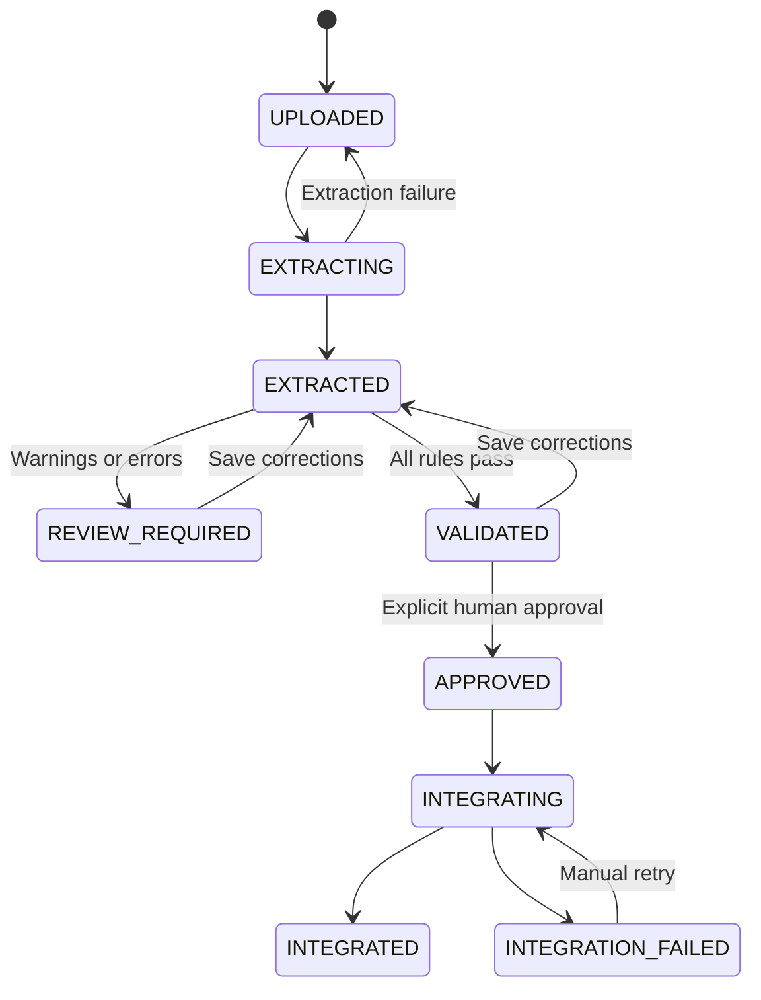

# Architecture and technical decisions

## Boundaries

The frontend has route-level pages, reusable presentation/form components, a typed API client and a loading-state hook. All business decisions are enforced by the API, including when UI controls are unavailable. No frontend code talks directly to the ERP simulator.

The backend separates HTTP routes, input schemas, domain services, persistence queries and external adapters. `main.py` only composes routes and lifecycle hooks. Domain rules do not import OpenAI or simulator internals. The OpenAI/demo providers share `InvoiceExtractionService`; ERP delivery shares `ERPConnector`.

The simulator is intentionally independent: a separate FastAPI process, a separate SQLite database and a separate API contract. This is the only extra service, because crossing a real network boundary is central to the project. Redis, message brokers and orchestration infrastructure would add cost without strengthening this local workflow.

## Database

Invoice identity, parties, money, states, references and timestamps are columns. Items, validation results, original field evidence, audit events and integration attempts are separate tables. Monetary values use a SQLAlchemy type that stores Decimal as text in SQLite; this avoids conversion through SQLite REAL. Foreign keys are enabled and WAL mode supports the small local workload.

The simulator stores a received document envelope with a unique source ID, invoice number and timestamp. Its payload is an immutable JSON receipt rather than the application's domain database. No application invoice data is reduced to a single JSON blob.

`create_all` initializes a new database; schema migrations are outside this prototype. SQLAlchemy version columns detect concurrent edits and workflow claims. A client must include its latest version when saving corrections.

## Extraction and normalization

The upload service checks extension, MIME, signature and PDF parseability, limits bytes/pages/text, stores under a UUID key and keeps filesystem paths out of responses. Source PDFs are retrieved only by invoice ID. Password-protected PDFs are rejected. Documents without text are retained with an actionable extraction error; scanned OCR is not claimed.

The demo provider parses labeled text from actual PDFs. It does not call a model or fabricate missing fields. Optional OpenAI extraction sends only the PDF text to the Responses API using a strict Pydantic output schema. Numeric strings preserve source information until normalization. Missing values are null. Prompts treat document content as untrusted; the schema is still followed by independent validation.

Normalization trims whitespace, uppercases currency, normalizes supported dates, parses explicit decimal/grouping forms and Arabic digits, and converts money to Decimal. Ambiguous or unsafe numeric values become missing. Original field values and confidence survive review in `extraction_results`.

## Validation and review

Rules cover required fields, valid date, supported currency, duplicate supplier/invoice number, missing tax IDs, item descriptions, positive quantities/prices, 0–100 tax rates, item net totals, subtotal, tax and grand total. Missing tax IDs and unresolved extraction uncertainty are warnings. Both warnings and errors block approval in this prototype.

Money assumptions: line net = quantity × unit price, rounded half-up to 0.01. Tax is rounded per line, then summed. Financial equality accepts an absolute difference up to 0.01. No floats participate in financial calculations or persistence. Dashboard percentages and elapsed times are operational measures, not invoice arithmetic.

Confidence is separate from business validity. High confidence never bypasses a rule. Saving human corrections acknowledges extraction uncertainty; business errors must still be corrected.

Saving clears old validation. Approval runs rules again to catch changed duplicate state. Approved records are immutable. Integration checks rules again rather than trusting the UI or a stale validation display.

## Delivery, failures and recovery

The transformation service produces an `ERPPayload` with structured parties/items and decimal strings. The connector uses HTTP with an explicit timeout. A separate simulation header selects SUCCESS/401/400/500/TIMEOUT; no production failure is implied.

The service commits INTEGRATING and a PENDING attempt **before** making the request. Success stores the ERP reference; failure stores HTTP code where known, error, duration and attempt number. Manual retry creates another attempt. Validation failures are not retried automatically.

The ERP has a unique constraint on source ID and returns the original reference on a matching retry. Reusing a source ID with a changed payload fails. A backend crash after remote acceptance may leave delivery uncertain; on restart, pending attempts become failed with an explicit unknown-delivery message. Retry uses the same key so remote acceptance can be reconciled without duplicate creation.

This is not a distributed transaction, and startup recovery requires a single API process. A future multiworker design would need durable ownership/leases and more explicit reconciliation.

## Monitoring and security boundaries

Dashboard metrics derive from stored invoices and attempt rows. Validation success is the share of processed invoices whose current rule results all pass. Integration success is successful/completed attempts, so unsuccessful attempts remain in the denominator after retries. Requests today use UTC. Health probes the simulator rather than inferring its availability from a label.

Application event logs use JSON and invoice IDs, avoiding full extracted documents or keys. UI/API errors expose safe messages; internal unexpected failures are logged. Local configuration is environment-based and `.env`/runtime data are ignored by Git and Docker build context.

This is a local single-user engineering demonstrator. Adding authentication, tenant isolation, migrations, malware scanning and compliance controls would be prerequisites for broader deployment.
